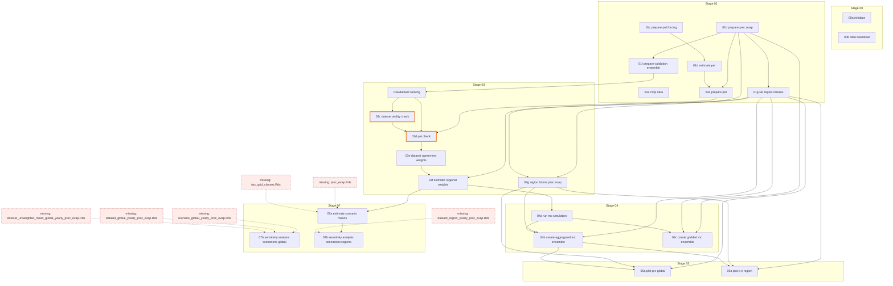

# Pipeline manifest

<!-- Generated by tools/make_manifest.R. Do not edit by hand: change the scripts in code/, then run `Rscript tools/make_manifest.R`. -->

A map of the scripts in `code/`, made by reading the code without running it. Start here: find the scripts a task touches and open only those. After changing a script, rerun what its *Rerun after changing* line lists.

- 23 pipeline scripts, run in name order; 2 parked (`XX_`); 3 archived.
- Scripts load `_source.R`: packages (data.table, fst, ggplot2), shared constants, and the `PATH_` folders that 00a saves in `paths.Rdata`. `PATH_SAVE` is set per machine in `_machine_paths.R`.
- A script reads the copy of a file written by the last script before it in name order.
- *Runs*: **raw data** and **downloads** need the machine with the raw inputs; **upstream outputs** runs anywhere the earlier outputs exist.

## Checks

**Will fail when run**

- **Missing input.** 07a line 16 reads `prec_evap.Rds`, which no script writes. Closest written name: `prec_evap.fst` (01b, in PATH_OUTPUT_OUTPUT).
- **Missing input.** 07a line 24 reads `twc_grid_classes.Rds`, which no script writes. Closest written name: `grid_classes.Rds` (01g, in PATH_OUTPUT_OUTPUT).
- **Missing input.** 07b_global line 11 reads `scenario_global_yearly_prec_evap.Rds`, which no script writes.
- **Missing input.** 07b_global line 15 reads `dataset_global_yearly_prec_evap.Rds`, which no script writes.
- **Missing input.** 07b_global line 19 reads `dataset_unweighted_mean_global_yearly_prec_evap.Rds`, which no script writes. Closest written name: `dataset_region_unweighted_mean_yearly_prec_evap.Rds` (07b_regions, in PATH_OUTPUT_DATA).
- **Missing input.** 07b_regions line 25 reads `dataset_region_yearly_prec_evap.Rds`, which no script writes.
- **Wrong folder.** 07a line 20 reads `weights_region_biome.Rds` from PATH_OUTPUT_DATA, but 03f writes it to PATH_OUTPUT_OUTPUT. It fails, or reads an old copy.
- **Undefined names.** 07b_global uses PALETTES, PATH_FIGURES, defined neither in the script nor in the shared setup.
- **Undefined names.** 07b_regions uses PALETTES, defined neither in the script nor in the shared setup.

**Can silently give wrong results**

- **Overwritten in place.** `dataset_ranks.Rds` is written by 03a and overwritten by 03c, 03d. Rerunning one of these alone applies its change to an already-changed file; rerun from 03a.

**Consistency**

- **Study years typed as numbers.** 07b_global (lines 26, 27), instead of the period constants in _source.R.
- **Study years typed as numbers.** 07b_regions (lines 32, 33), instead of the period constants in _source.R.
- **Same constant, different values.** DATASET_COLS: `c(ERA5L = "#1b9e77", FLDAS = "#d95f02", GLEAM = "#7570b3"...` in 07b_global; `make_dataset_colours(dataset_ids)` in 07b_regions.
- **Same constant, different values.** EXCLUDED_REGIONS: `c("BOB", "ARS", "GIC")` in 01g; `character(0)` in 07a.

**Links not visible here (file names built at run time)**

- 01a: `saveNC(file.path(path_out, cropped_basename(file, period)))`
- 01b: `brick(file)`
- 01c: `rast(nc_path)`

## Run order

| Script | What it does | Reads from | Runs |
|---|---|---|---|
| 00a | Initialize project paths for the ithaca dataset workflow | - | no inputs |
| 00b | Download raw precipitation, evaporation, and PET data from Zenodo | - | downloads |
| 01a | Crop the raw precipitation and evaporation datasets to the study period | - | raw data |
| 01b | Prepare and widen the cropped yearly precipitation and evaporation datasets for the TWC change workflow | run-time names | upstream outputs |
| 01c | Convert MERRA2 and MSWX-Past NetCDF forcing into monthly data.tables | run-time names | raw data |
| 01d | Estimate yearly potential evapotranspiration from MERRA2 and MSWX-Past | 01c | upstream outputs |
| 01e | Prepare potential evapotranspiration (PET) products for twc_change | 01b, 01d | upstream outputs |
| 01f | Estimate candidate-specific leave-out reference statistics for precipitation and evaporation | 01b | upstream outputs |
| 01g | Build spatial classes for the complete TWC grid | 01b | upstream outputs |
| 03a | Rank candidate precipitation and evaporation datasets against candidate specific leave-out reference statistics | 01f | upstream outputs |
| 03c | (no header) | 03a | upstream outputs |
| 03d | (no header) | 01e, 03a, 03c | upstream outputs |
| 03e | Dataset agreement weights for twc_change under TEN weighting scenarios | 03d | upstream outputs |
| 03f | Aggregate grid-cell dataset agreement weights to region-biome probabilities | 01g, 03e | upstream outputs |
| 03g | Estimate dataset annual means by IPCC region and biome | 01b, 01g | upstream outputs |
| 04a | Generate Monte Carlo dataset selections | 03f | upstream outputs |
| 04b | Aggregate the 100 x 10 scenario Monte Carlo selections to annual P and E ensembles | 01g, 03g, 04a | upstream outputs |
| 04c | Build public BASE and CHANGE land-cell Monte Carlo ensembles | 01b, 01g, 04a | upstream outputs |
| 05a_global | Compare original datasets and Monte Carlo scenarios in P-E and ΔP-ΔE space for Global, Northern Hemisphere, and... | 01g, 03g, 04b | upstream outputs |
| 05a_region | Compare original datasets and Monte Carlo scenarios in P-E and ΔP-ΔE space for each IPCC region | 01g, 03g, 04b | upstream outputs |
| 07a | Build scenario mean precipitation and evaporation from region-biome weights | 03f | upstream outputs |
| 07b_global | Plot global mean changes in availability versus flux space | - | upstream outputs |
| 07b_regions | Plot regional mean changes in availability versus flux space | 07a | upstream outputs |

## Dependency graph

Orange border: overwrites its input in place. Red: missing input.

## Scripts

### 00a_initialize.R

- Writes to PATH_OUTPUT: paths.Rdata (read by _source.R)
- Rerun after changing: 00b to 07b_regions
- does not source _source.R
- Constants: PATH_OUTPUT, PATH_OUTPUT_DATA, PATH_OUTPUT_RAW, PATH_OUTPUT_RAW_PREC, PATH_OUTPUT_RAW_EVAP, PATH_OUTPUT_RAW_OTHER, PATH_OUTPUT_INPUT, PATH_OUTPUT_OUTPUT, PATH_OUTPUT_DATASET, PATH_OUTPUT_FIGURES, PATH_OUTPUT_TABLES

### 00b_data_download.R

- Rerun after changing: not tracked (outputs are downloads or have names built at run time)
- packages: jsonlite
- Constants: PRECIPE_RECORD_ID = "14290970", EVAPORE_RECORD_ID = "21369628", ITHACA_RECORD_ID = "21353180", PREC_NAMES_SHORT_LCASE, PREC_ENSEMBLE_NAMES_SHORT_LCASE, PREC_ALL_NAMES_SHORT_LCASE, PREC_NAMES_PATTERN, EVAP_ENSEMBLE_NAMES_SHORT_LCASE, EVAP_NAMES_PATTERN, ITHACA_FILE_DESTINATIONS

### 01a_crop_data.R

- Names built at run time: `saveNC(file.path(path_out, cropped_basename(file, period)))`
- Rerun after changing: not tracked (outputs are downloads or have names built at run time)
- packages: doParallel; shared: FULL_PERIOD, N_DATASETS_EVAP, N_DATASETS_PREC; parallel: registerDoParallel, foreach

### 01b_prepare_prec_evap.R

- Writes to PATH_OUTPUT_OUTPUT: prec_evap_raw.fst (read by 01f), twc_complete_grid.Rds (read by 01e, 01g), prec_evap.fst (read by 03g, 04c)
- Names built at run time: `brick(file)`
- Rerun after changing: 01e to 07a, 07b_regions
- packages: raster; shared: EVAP_NAMES_SHORT, PREC_NAMES_SHORT; random: sample (seeded)
- Constants: DATASET_NAME_BY_TOKEN

### 01c_prepare_pet_forcing.R

- Writes to PATH_OUTPUT_RAW_OTHER: merra2_pet-forcing_mixed_1980_2024_025_monthly.fst (read by 01d), mswx-past_pet-forcing_mixed_1980_2024_025_monthly.fst (read by 01d)
- Names built at run time: `rast(nc_path)`
- Rerun after changing: 01d, 01e, 03d to 03f, 04a to 07a, 07b_regions
- packages: terra
- Constants: PERIOD_FIRST_YEAR = 1980, PERIOD_LAST_YEAR = 2024, PERIOD_START, PERIOD_END, MONTHS_PER_YEAR = 12, EXPECTED_MONTH_COUNT, OUTPUT_FILES, COORDINATE_DIGITS = 4, MERGE_KEYS, MERRA2_FILES, MSWX_FILES, FORCING_FILES

### 01d_estimate_pet.R

- Reads from PATH_OUTPUT_RAW_OTHER: merra2_pet-forcing_mixed_1980_2024_025_monthly.fst (01c), mswx-past_pet-forcing_mixed_1980_2024_025_monthly.fst (01c)
- Writes to PATH_OUTPUT_RAW_OTHER: merra2_mswx_pet_mm_1980_2024_yearly.fst (read by 01e)
- Rerun after changing: 01e, 03d to 03f, 04a to 07a, 07b_regions
- Constants: INPUT_FILES, FILE_PET_OUT, PERIOD_FIRST_YEAR = 1980, PERIOD_LAST_YEAR = 2024, MONTHS_PER_YEAR = 12, EXPECTED_YEAR_COUNT, PET_METHOD_COLUMNS, EXPECTED_COMBINATION_COUNT, PET_DECIMAL_DIGITS = 1, REPRESENTATIVE_DAYS, DAYS_IN_MONTH, DAYS_IN_LEAP_FEBRUARY = 29, DAYS_PER_YEAR = 365.25, SOLAR_CONSTANT = 0.082, W_TO_MJ_PER_DAY = 0.0864, STEFAN_BOLTZMANN = 4.903e-09, SURFACE_EMISSIVITY = 0.98, VAPOUR_MASS_RATIO = 0.622, PSYCHROMETRIC_COEFFICIENT = 0.00163, WIND_MEASUREMENT_HEIGHT = 10, HARGREAVES_COEFFICIENT = 0.0023, HARGREAVES_TEMPERATURE_LIMIT = -17.8, OUDIN_TEMPERATURE_LIMIT = -5, OUDIN_SCALE = 100, HAMON_COEFFICIENT, ENERGY_ONLY_COEFFICIENT = 0.8, PRIESTLEY_TAYLOR_ALPHA = 1.26

### 01e_prepare_pet.R

- Reads from PATH_OUTPUT_RAW_OTHER: merra2_mswx_pet_mm_1980_2024_yearly.fst (01d)
- Reads from PATH_OUTPUT_OUTPUT: twc_complete_grid.Rds (01b)
- Writes to PATH_OUTPUT_OUTPUT: pet.fst (not read), pet_mean.fst (read by 03d)
- Rerun after changing: 03d to 03f, 04a to 07a, 07b_regions
- packages: lubridate; shared: FULL_PERIOD

### 01f_prepare_validation_ensemble.R

- Reads from PATH_OUTPUT_OUTPUT: prec_evap_raw.fst (01b)
- Writes to PATH_OUTPUT_OUTPUT: prec_reference_values.fst (read by 03a), evap_reference_values.fst (read by 03a)
- Rerun after changing: 03a to 03f, 04a to 07a, 07b_regions
- packages: trend; shared: EVAP_ENSEMBLE_NAMES_SHORT, EVAP_NAMES_SHORT, FULL_PERIOD, PREC_ENSEMBLE_NAMES_SHORT
- Constants: P_VALUE_THRESHOLD = 0.1, MIN_YEARS_FOR_TREND

### 01g_set_region_classes.R

- Reads from PATH_OUTPUT_OUTPUT: twc_complete_grid.Rds (01b)
- Writes to PATH_OUTPUT_OUTPUT: region_classes.Rds (not read), grid_classes.Rds (read by 03f, 03g, 04b to 05a_region)
- Rerun after changing: 03f to 07a, 07b_regions
- packages: pRecipe
- Constants: EXCLUDED_REGIONS, HEMISPHERE_LEVELS, LAT_ZONE_LEVELS, LAT_TROPICS = 23.5, LAT_MIDLATITUDE = 35, LAT_HIGHLATITUDE = 60

### 03a_dataset_ranking.R

- Reads from PATH_OUTPUT_OUTPUT: prec_reference_values.fst (01f), evap_reference_values.fst (01f)
- Writes to PATH_OUTPUT_OUTPUT: dataset_ranks.Rds (read by 03c), prec_evap_stats.Rds (read by 03c, 03d)
- Rerun after changing: 03c to 03f, 04a to 07a, 07b_regions
- Constants: EPSILON = 1e-06, PROPERTY_BIAS

### 03c_dataset_aridity_check.R

- Reads from PATH_OUTPUT_OUTPUT: prec_evap_stats.Rds (03a), dataset_ranks.Rds (03a)
- Writes to PATH_OUTPUT_OUTPUT: dataset_ranks.Rds (overwritten in place; read by 03d)
- Rerun after changing: 03a, then this script (it overwrites `dataset_ranks.Rds` in place), then 03d to 03f, 04a to 07a, 07b_regions
- Constants: ARIDITY_THRES = 0.9

### 03d_pet_check.R

- Reads from PATH_OUTPUT_OUTPUT: prec_evap_stats.Rds (03a), pet_mean.fst (01e), dataset_ranks.Rds (03c)
- Writes to PATH_OUTPUT_OUTPUT: dataset_ranks.Rds (overwritten in place; read by 03e)
- Rerun after changing: 03a, 03c, then this script (it overwrites `dataset_ranks.Rds` in place), then 03e, 03f, 04a to 07a, 07b_regions

### 03e_dataset_agreement_weights.R

- Reads from PATH_OUTPUT_OUTPUT: dataset_ranks.Rds (03d)
- Writes to PATH_OUTPUT_OUTPUT: dataset_weights.Rds (read by 03f), dataset_weights_base_detailed.Rds (not read), dataset_weight_diagnostics.Rds (not read)
- Rerun after changing: 03f, 04a to 07a, 07b_regions
- packages: grid, maps
- Constants: SHARES_BASE, CHANGE_TREND_SHARE = 0.75, CHANGE_SIG_SHARE = 0.75, RANK_SLOPE_SHARE = 0.5, RANK_EXP_BASE = 0.5, RANK_N, RANK_COLS, WEIGHT_SCENARIOS, LOSS_WEIGHT_MAP, COMBINE_SPEC, REQUIRED_COLS, BASE_OUTPUT_COLS, TRANSFORMS

### 03f_estimate_regional_weights.R

- Reads from PATH_OUTPUT_OUTPUT: dataset_weights.Rds (03e), grid_classes.Rds (01g)
- Writes to PATH_OUTPUT_OUTPUT: weights_region_biome.Rds (read by 04a, 07a)
- Rerun after changing: 04a to 07a, 07b_regions

### 03g_region_biome_prec_evap.R

- Reads from PATH_OUTPUT_OUTPUT: prec_evap.fst (01b), grid_classes.Rds (01g)
- Writes to PATH_OUTPUT_OUTPUT: dataset_region_biome_year.Rds (read by 04b, 05a_global, 05a_region)
- Rerun after changing: 04b, 05a_global, 05a_region
- Constants: OUTPUT_FILE

### 04a_run_mc_simulation.R

- Reads from PATH_OUTPUT_OUTPUT: weights_region_biome.Rds (03f)
- Writes to PATH_OUTPUT_OUTPUT: weight_cdf_scenarios.Rds (not read), mc_random_region_biome_scenarios.Rds (not read), mc_selection_scenarios.Rds (read by 04b, 04c), mc_selection_matrix_scenarios.Rds (not read), mc_selection_change.Rds (not read)
- Rerun after changing: 04b to 05a_region
- random: runif (seeded)
- Constants: N_SIMS_SENSITIVITY = 100L, N_SIMS_CHANGE = 1000L, MC_SEED = 1979L, CHANGE_SCENARIO = "change"

### 04b_create_aggregated_mc_ensemble.R

- Reads from PATH_OUTPUT_OUTPUT: dataset_region_biome_year.Rds (03g), grid_classes.Rds (01g), mc_selection_scenarios.Rds (04a)
- Writes to PATH_OUTPUT_OUTPUT: mc_region_biome_year_scenarios.fst (read by 05a_global, 05a_region), mc_region_year_scenarios.Rds (not read), mc_global_year_scenarios.Rds (not read)
- Rerun after changing: 05a_global, 05a_region

### 04c_create_gridded_mc_ensemble.R

- Reads from PATH_OUTPUT_OUTPUT: prec_evap.fst (01b), grid_classes.Rds (01g), mc_selection_scenarios.Rds (04a)
- Writes to PATH_OUTPUT_DATASET: dataset_lookup.csv (not read), region_lookup.csv (not read), biome_lookup.csv (not read), manifest.csv (not read)
- Rerun after changing: nothing downstream
- packages: ncdf4
- Constants: PUBLIC_SCENARIOS, N_MEMBERS = 100L, MEMBER_BATCH_SIZE = 20L, NC_MISSING = -9999, N_CELLS

### 05a_plot_p_e_global.R

- Reads from PATH_OUTPUT_OUTPUT: dataset_region_biome_year.Rds (03g), grid_classes.Rds (01g), mc_region_biome_year_scenarios.fst (04b)
- Writes to PATH_OUTPUT_OUTPUT: pe_dataset_vs_scenarios.png (figure), delta_pe_dataset_vs_scenarios.png (figure), dataset_scope_mean.Rds (not read), mc_scope_mean_scenarios.Rds (not read), dataset_scope_change.Rds (not read), mc_scope_change_scenarios.Rds (not read), mc_scope_mean_centroids.Rds (not read), mc_scope_change_centroids.Rds (not read)
- Rerun after changing: nothing downstream
- packages: ggrepel

### 05a_plot_p_e_region.R

- Reads from PATH_OUTPUT_OUTPUT: dataset_region_biome_year.Rds (03g), grid_classes.Rds (01g), mc_region_biome_year_scenarios.fst (04b)
- Writes to PATH_OUTPUT_OUTPUT: pe_dataset_vs_scenarios_ipcc_regions.png (figure), delta_pe_dataset_vs_scenarios_ipcc_regions.png (figure), dataset_region_mean.Rds (not read), mc_region_mean_scenarios.Rds (not read), dataset_region_change.Rds (not read), mc_region_change_scenarios.Rds (not read)
- Rerun after changing: nothing downstream
- packages: ggrepel

### 07a_estimate_scenario_means.R

- Reads from PATH_OUTPUT_OUTPUT: prec_evap.Rds (MISSING)
- Reads from PATH_OUTPUT_DATA: weights_region_biome.Rds (03f), twc_grid_classes.Rds (MISSING)
- Writes to PATH_OUTPUT_DATA: scenario_prec_evap_grid.Rds (not read), scenario_prec_evap_region_biome.Rds (not read), scenario_prec_evap_region.Rds (read by 07b_regions)
- Rerun after changing: 07b_regions
- packages: parallel; parallel: mclapply (Windows guard)
- Constants: EXCLUDED_REGIONS, SCENARIOS, N_WORKERS

### 07b_sensitivity_analysis_scenarions_global.R

- Reads from PATH_OUTPUT_DATA: scenario_global_yearly_prec_evap.Rds (MISSING), dataset_global_yearly_prec_evap.Rds (MISSING), dataset_unweighted_mean_global_yearly_prec_evap.Rds (MISSING)
- Writes to PATH_OUTPUT_DATA: global_avail_flux_change_plot_dt.Rds (not read)
- Writes to PATH_FIGURES: global_mean_avail_flux_change_space.png (figure)
- Rerun after changing: nothing downstream
- packages: ggrepel, scales
- Constants: PERIOD_1, PERIOD_2, SCENARIO_LABELS, SCENARIO_COLS, DATASET_COLS, STORY_COLS

### 07b_sensitivity_analysis_scenarions_regions.R

- Reads from PATH_OUTPUT_DATA: scenario_prec_evap_region.Rds (07a), dataset_region_yearly_prec_evap.Rds (MISSING)
- Writes to PATH_OUTPUT_DATA: dataset_region_unweighted_mean_yearly_prec_evap.Rds (not read), regional_avail_flux_change_plot_dt.Rds (not read)
- Rerun after changing: nothing downstream
- packages: RColorBrewer, ggrepel, scales
- Constants: PERIOD_1, PERIOD_2, REGIONS_PER_PAGE = 9, N_COLS = 3, N_ROWS = 3, SCENARIO_LABELS, SCENARIO_COLS, DATASET_COLS_BASE, STORY_COLS, DATASET_COLS

## Shared setup

- `_machine_paths.R`: Machine-specific base path for the ithaca_dataset workflow. Sourced by 00a, _source.R.
- `_source.R`: Sourced by 22 scripts.

| Shared constant | Value | Used by (directly or through another) |
|---|---|---|
| PREC_NAMES_SHORT | `c("ERA5L", "FLDAS", "MERRA", "TERRA", "MSWEP")` | 01a, 01b |
| PREC_ENSEMBLE_NAMES_SHORT | `c("CPC", "GPCC", "EARTH", "ERA5L", "FLDAS", "MERRA", "PRE...` | 01a, 01f |
| PREC_ALL_NAMES_SHORT | `unique(c(PREC_NAMES_SHORT, PREC_ENSEMBLE_NAMES_SHORT))` | 01a |
| N_DATASETS_PREC | `length(PREC_ALL_NAMES_SHORT)` | 01a |
| EVAP_NAMES_SHORT | `c("ERA5L", "FLDAS", "MERRA", "TERRA", "GLEAM")` | 01a, 01b, 01f |
| EVAP_ENSEMBLE_NAMES_SHORT | `c("BESS", "ERA5L", "ETMON", "ETSYN", "FLDAS", "GLEAM", "M...` | 01a, 01f |
| EVAP_ALL_NAMES_SHORT | `unique(c(EVAP_NAMES_SHORT, EVAP_ENSEMBLE_NAMES_SHORT))` | 01a |
| N_DATASETS_EVAP | `length(EVAP_ALL_NAMES_SHORT)` | 01a |
| START_PERIOD_1 | `1982` | 01a, 01e, 01f |
| END_PERIOD_1 | `2001` | - |
| START_PERIOD_2 | `2002` | - |
| END_PERIOD_2 | `2021` | 01a, 01e, 01f |
| FULL_PERIOD | `c(START = START_PERIOD_1, END = END_PERIOD_2)` | 01a, 01e, 01f |
| MY_PALETTE | `c("#4D648D", "#337BAE", "#97B8C2", "#739F3D", "#ACBD78", ...` | - |

## Not part of the pipeline

- `code/XX_global_prec_evap.R` (parked): Estimate dataset global annual means
- `code/XX_plot_bw_maps.R` (parked): Build most and least dataset maps
- `code/archive/05a_estimate_ensemble_change.R` (archived)
- `code/archive/05b_estimate_ensemble_mean_change_grid.R` (archived)
- `code/archive/05c_global_twc_change_storylines.R` (archived)
